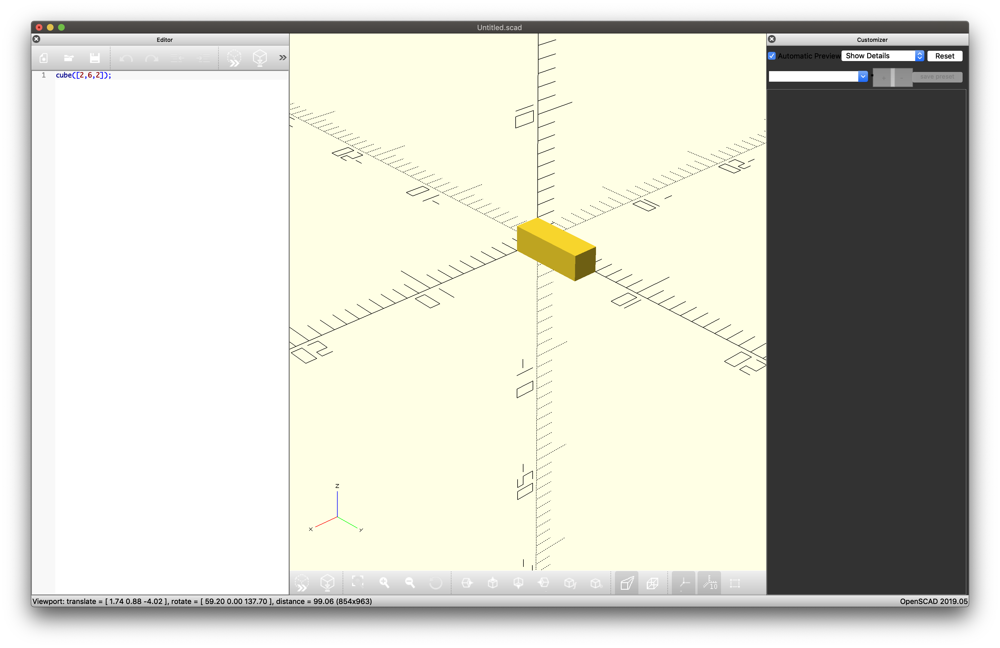

# Generative Architecture for CAD and Beyond...

## Motivation
*"Only by having clear and vital images of the many alternatives, good and bad, of where one can go, will we have any control over the way we may actually get there in a reality tomorrow will bring all too quickly." -- Samuel Delany*

*"I learned to see freedom as always and intimately linked to the issue of transforming space" --bell hooks*
 
 This project is the beginning of a speculative exploration into experimental and possibly impossible forms of architecture and space creation. We will use Python to create generative models that we can then turn into CAD for 3-D printing and HTML for WebVR.

## No-Stop City


I wanted to start by recreating a base case, in this case Archizoom Associati's No-Stop City project of 1966-72. No-Stop City consists of plans and drawings of an endless grid of structures that would span the whole world. "The metropolis ceases to be a 'place,' to become a 'condition' (Varnelis, 87).


No-Stop City describes "an amoral city, a city without qualities...instead of denying this logic [of maximum quantity], we decided to make use of its inner workings to achieve a demystification of all its ideals" (Varnelis, 87). That is, by co-opting the logic of the capitalist superstructure (supermarkets, factories) and extending it to its maximum logical conclusion, No-Stop City paradoxically describes a system where the individual can achieve psychomotor creative freedom.

The aim is to take a closer look at this radical practice from the past and see how it can inform responses to contemporary challenges. We will first create a Python script that will give us a model describing our own No-Stop City. This model can then be converted into different output formats. This way we can instantiate the model in different formats without having to rewrite our underlying logic.


Full code sample for this project can be found on [Repl.it](https://repl.it/@deadalive/simplearchitecturegenerator).

A sandbox of the WebVR portion of this project can be found on [Glitch](https://celestial-majestic-shadow.glitch.me/).


## First Model
Our first model will be very simple. It represents a uniform grid of arbitrary size that contains one type of structure ("structure-1" will serve as our placeholder for now). Each structure will also contain a rotation vector with a random rotation, either 0 or 90 degrees.

```python
import random
import json
# instantiate model
model = {
	"metadata":  {
	"name":  "noise_grid_architecture_generator",
	}
}
# populate grid
GRID_HEIGHT = 5
GRID_WIDTH = 5
grid = []
for col in  range(GRID_HEIGHT):
	for row in  range(GRID_WIDTH):
		cell = {
			"type": "structure1",
			"coords": [row, col],
			"rotation":  [random.choice([0,  90]), random.choice([0,  90])]
		}
		grid.append(cell)
		 
# output to file
model["grid"] = grid
f = open(model["metadata"]["name"]+".json",  "w")
f.write(json.dumps(model))
f.close()
```

Now we have our model with a grid and we've outputted it to JSON so it can be consumed by our Converters.

## Our First Converter
The first thing I would like to do is export my model to OpenSCAD which is my preferred tool for 3-D printing. OpenSCAD uses SCAD language to describe geometries so I will create a converter to take our JSON model and turn it into something OpenSCAD can understand.

First let's import our model:

```python
import json

def load_model(model_name):
	f = open(model_name,"r")
	model = json.loads(f.read())
	f.close()
	return model

MODEL_NAME = "noise_architecture_generator.json"
model = load_model(MODEL_NAME)
```
Next let's define a dictionary that will map our structure type to what we want OpenSCAD to show. This is trivial for this example since we only have one structure ("structure1"). In No-Stop City we see a series of rectangles laid out in a grid so we'll map our structure to the OpenSCAD `cube` function.

```python
# define the dimensions of the rectangle  
STRUCT_HEIGHT = 2
STRUCT_WIDTH = 6
STRUCT_DEPTH = 2
def structure1():
	return  'cube([{0},{1},{2}]);'.format(STRUCT_HEIGHT, STRUCT_WIDTH, STRUCT_DEPTH)

struct_map = {
	'structure1': structure1
}
```



Now that we have our map let's go ahead and print out each cell of the grid. We'll define our cell size and loop through our model's grid to populate it with structures.

```python
# define our cell dimensions
CELL_WIDTH = 10
CELL_HEIGHT = 10
# the translate function allows us to position our structs in a grid
def translate(x, y, z=0):
	cell_x = CELL_WIDTH * x	
	cell_y = CELL_HEIGHT * y
	return  'translate([{0}, {1}])'.format(cell_x, cell_y)

# construct our final output string that will be consumed by OpenSCAD
output = ''
for cell in model['grid']:
	struct_fn = struct_map[cell['type']]
	coords = cell['coords']
	translation = translate(coords[0], coords[1])
	struct = struct_fn()
	output += translation + ' ' + struct
print(output)
```
If we copy our output in OpenSCAD we should see our grid:


Notice that all of our structures have the same rotation. We haven't coded that up yet. Let's add a rotation function and modify our output to use it.
```python
def rotate(rotation_coords):
	(x, y) = rotation_coords
	return  'rotate([{0},{1}])'.format(x, y)
	def generate_output():

def generate_output():
	output = ''
	for cell in model['grid']:
		rotation_coords = cell['rotation']
		rotation = rotate(rotation_coords)
		coords = cell['coords']
		translation = translate(coords)
		struct_fn = struct_map[cell['type']]
		struct = struct_fn()
		output += '{0} {1} {2};'.format(translation, rotation, struct)
	return output
```


## More Converters!
Now that we have a simple CAD file of our version of No-Stop City it's time to print it! But I don't have my 3-D printer on hand and I need to buy new filaments. But I'd still like to experience this scene in 3-D, something like virtual reality where I can walk around the architecture. Thankfully Mozilla's A-Frame framework allows us to write WebVR using HTML tags and transformations that are not so far off from SCAD. So let's write a new converter! 


This converter will function just like our SCAD converter, taking in our model as input and outputting a series of A-Frame HTML tags to describe it.

Notice that only the `generate_output` function needs to change--we could abstract away the shared logic into a Converter class to make it easier to reuse.

If we take our output and plop it into an A-Frame scene we can now move around our 3-D space!


## Next Steps

 - More generators! (our simple noise generator one is nice, but what about different types of noise? What does a cellular automata generator look like?)
 - More converters! (what would our city look like plotted by a pen plotter?)
 - More structures!

